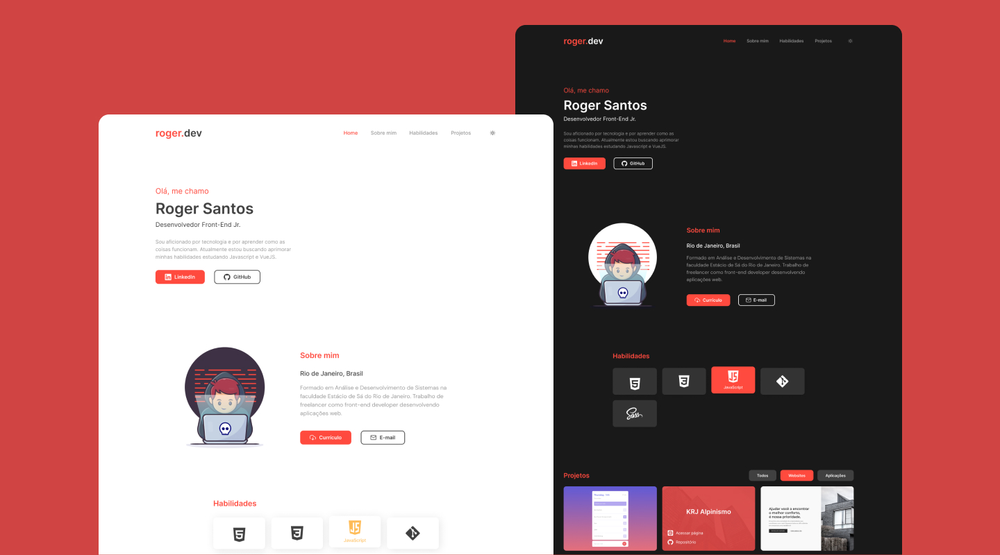

<h1 align="center">
  Portfólio
</h1>

  

  <a href="#-tecnologias">Tecnologias</a>&nbsp;&nbsp;&nbsp;|&nbsp;&nbsp;&nbsp;
  <a href="">Projeto</a>&nbsp;&nbsp;&nbsp;|&nbsp;&nbsp;&nbsp;
  <a href="#memo-licença">Licença</a>

<!-- 

  

  

  

 -->

 

## 🚀 Tecnologias

Esse projeto está sendo desenvolvido com as seguintes tecnologias:

- HTML
- Sass
- JavaScript

## 🚧 Projeto:

Link do Projeto: [Portfólio]()

<!-- 
:heavy_check_mark: Mobile

:construction: Desktop
 -->

<!-- ## 🎨 Inspiração:

Comunidade: [Codelândia](https://discord.gg/DvpRxMWW) -->

## :memo: Licença

Esse projeto está sob a licença MIT. Veja o arquivo [LICENSE](./.github/LICENSE) para mais detalhes.

---

Feito por Roger Santos
